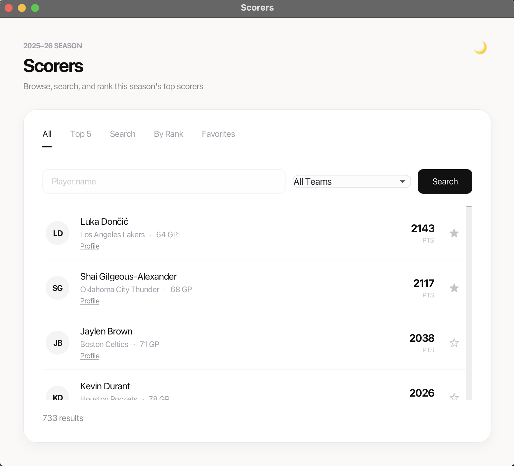
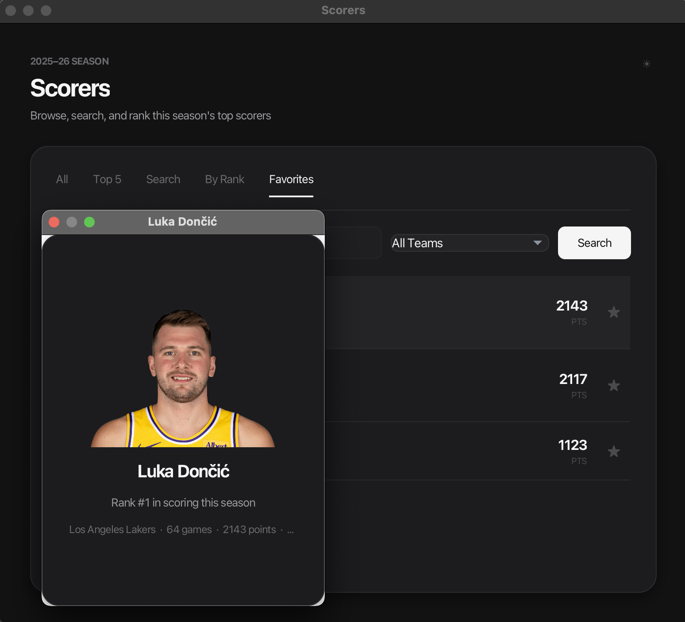

# NBA Scorers App

JavaFX desktop app to browse, search, and rank NBA top scorers, with team filters, favorites, player profiles and dark mode.





## Features

- Browse all players from the 2025-26 season (733 entries)
- Top 5 scorers view
- Search by player name and filter by team
- Look up players by rank
- Mark players as favorites (saved locally between sessions)
- Light and dark theme
- View detailed profiles with pictures for the top 5 players

## Tech stack

- Java 17
- JavaFX 21
- Maven

## What I practiced

This is a learning project. I built it to practice:

- **Classes and object-oriented programming in Java:** splitting the code into separate classes with clear responsibilities, such as `Player`, `FileScanner`, and `FavoritesManager`
- **Reading data from a text file:** parsing each line into `Player` objects and loading them when the app starts
- **Writing data back to a text file:** saving and loading the user's favorite players
- **Building a GUI with JavaFX:** tabs, lists, search and filter controls, and styling with CSS (including a dark theme)

## How to run

Requirements: JDK 17+. Maven does not need to be installed, because the project includes the Maven Wrapper.

**In IntelliJ IDEA:**

1. Clone the repo and open it as a Maven project
2. Open the **Maven** panel (right sidebar)
3. Go to **Plugins → javafx → javafx:run** and double-click it

**From the terminal:**

```bash
# macOS / Linux
./mvnw clean javafx:run

# Windows
mvnw.cmd clean javafx:run
```

## Data and credits

- Player statistics: [Basketball Reference, 2025-26 season totals](https://www.basketball-reference.com/leagues/NBA_2026_totals.html)
- Player images are used for educational purposes only and belong to their respective owners.